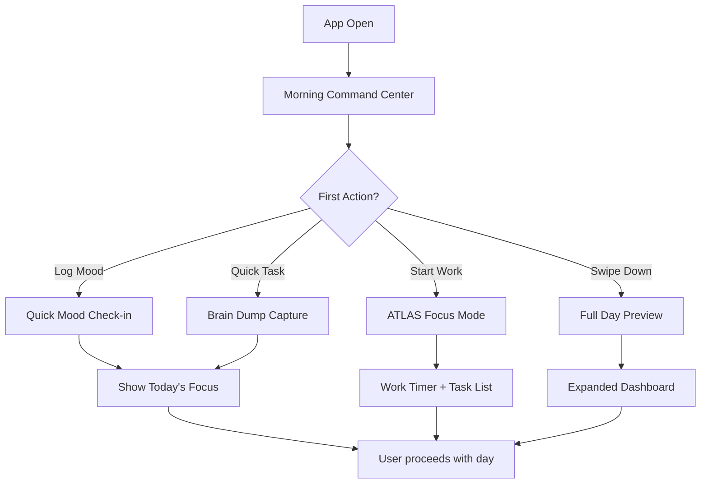
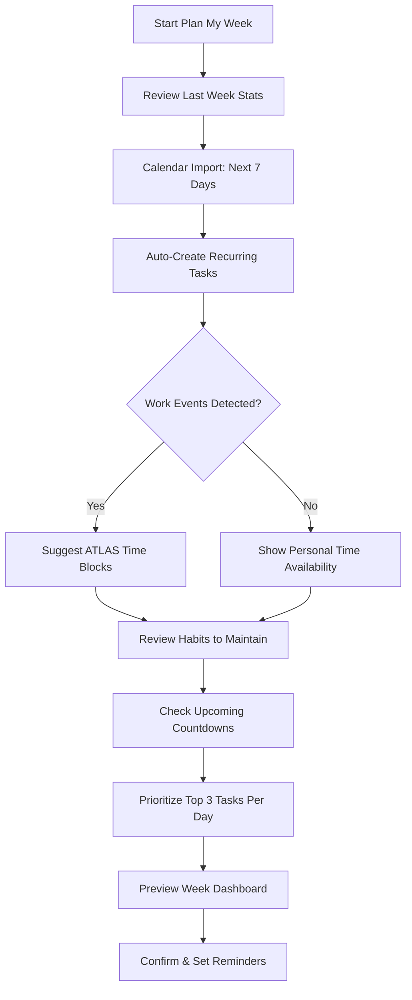

# Daily Workflow Design - ADHD-Optimized Productivity App

## Executive Summary

This workflow design prioritizes **immediate actionability**, **context awareness**, and **cognitive load reduction** for users with ADHD. The system uses proactive intelligence to surface the right information at the right time, while maintaining simplicity and preventing overwhelm.

---

## 1. MORNING ROUTINE WORKFLOW (6 AM - 10 AM)

### First Open Experience

**PRIORITY: Reduce decision fatigue, provide immediate clarity**

#### Landing View: "Morning Command Center"

```
┌─────────────────────────────────────────┐
│  Good morning! Monday, Jan 15          │
│  ⏰ 8:23 AM                             │
├─────────────────────────────────────────┤
│  TODAY'S FOCUS (3 items max)           │
│  ✓ Morning routine (streak: 45 days)  │
│  ○ Write PRD for workflow feature      │
│  ○ Team standup at 10 AM               │
├─────────────────────────────────────────┤
│  URGENT ATTENTION (only if critical)   │
│  🚨 Oil change overdue by 2 days       │
│  🎫 Taylor Swift - tickets release 2PM │
├─────────────────────────────────────────┤
│  QUICK ACTIONS                          │
│  [Log Mood] [Quick Task] [Start Work]  │
└─────────────────────────────────────────┘
```

#### Information Hierarchy (Top to Bottom)

1. **Greeting + Context** (time/date awareness)
2. **Today's Focus** (max 3 items):
   - Active habit streaks (motivation reinforcement)
   - Highest priority task due today
   - Next calendar event within 4 hours
3. **Urgent Attention** (only show if exists):
   - Overdue chores/countdowns
   - Time-sensitive opportunities
4. **Quick Actions** (single-tap common needs)

#### WHY This Design?

- **ADHD Challenge**: Morning decision paralysis
- **Solution**: Pre-filtered to 3 actionable items max
- **Cognitive Load**: Single screen, no scrolling required
- **Motivation**: Lead with success (habit streaks)

---

### Morning Flow Sequence



#### Automatic Background Actions (Invisible)

- Check for overdue items (chores, tasks, countdowns)
- Calculate habit completion percentage
- Identify time-sensitive events (next 4 hours)
- Pre-load Spotify "recently played" for context
- Sync calendar events for today

---

### Dashboard Information Hierarchy (Full Day View)

**Accessed via: Swipe down on Morning Command Center**

```
Priority 1: TIME-SENSITIVE (Red Zone)
├─ Overdue tasks (with days overdue count)
├─ Countdowns < 48 hours
├─ Calendar events < 2 hours away
└─ Chores past due date

Priority 2: TODAY'S COMMITMENTS (Yellow Zone)
├─ Tasks due today (sorted by priority)
├─ Habits not yet completed
├─ Calendar events today
└─ Chores due this week

Priority 3: CONTEXT (Green Zone)
├─ Active work timer (ATLAS)
├─ Current mood trend (3-day average)
├─ Upcoming concerts/events (next 30 days)
└─ Weekly habit completion %

Priority 4: QUICK CAPTURE (Always Visible Footer)
└─ [+ Task] [+ Habit Log] [+ Journal] [+ Mood]
```

#### WHY This Hierarchy?

- **Red Zone**: Immediate action required (ADHD thrives on urgency)
- **Yellow Zone**: Today's scope (prevents "future overwhelm")
- **Green Zone**: Passive awareness (no action needed)
- **Footer**: Always accessible for brain dumps

---

## 2. THROUGHOUT THE DAY (10 AM - 6 PM)

### Proactive Notification Strategy

**PRINCIPLE: Notify only when user CAN and SHOULD act**

#### Mood Log Triggers (Smart Timing)

```javascript
// Trigger conditions (any ONE triggers prompt):
1. After completing a habit (positive reinforcement)
2. 2 hours after calendar event (reflection opportunity)
3. No mood log in 6 hours + user opens app
4. End of work focus session (ATLAS)
5. Manual trigger only if last log > 24 hours ago

// Never prompt:
- During active focus timer
- Between 10 PM - 7 AM
- Within 1 hour of last mood log
```

**Notification Format**:
```
"Just finished your workout! How are you feeling?"
[😊 Great] [😐 Okay] [😔 Low] [Skip]
```

---

#### Task Surfacing Algorithm

**CONTEXT-AWARE TASK DISPLAY**

| Time of Day | Tasks Shown | Logic |
|-------------|-------------|-------|
| Morning (6-10 AM) | Top 3 priority tasks due today | Focus energy on most important |
| Mid-day (10 AM-2 PM) | Tasks tagged with current Space + calendar context | Show relevant work |
| Afternoon (2-6 PM) | Quick wins (tasks < 30 min) + overdue | Energy dip = easy wins |
| Evening (6-10 PM) | Personal tasks only | Work/life separation |

**Dynamic Re-prioritization**:
```javascript
// Task priority score recalculated every hour:
score =
  (basePriority * 3) +
  (daysUntilDue * -2) +
  (relatedToCurrentSpace * 5) +
  (matchesRecentMoodPattern * 2) +
  (timeOfDayOptimal * 4)

// Example: "Exercise" task scores higher in morning if mood data shows AM correlation
```

---

#### Countdown Display Rules

**URGENCY-BASED VISIBILITY**

| Countdown Type | Show When | Where | Action |
|----------------|-----------|-------|--------|
| Critical (chores) | < 7 days OR overdue | Dashboard Red Zone | Create task prompt |
| Upcoming events | 2 weeks - 48 hours | Dashboard Yellow Zone | Passive display |
| Concerts | 1 month - 1 week | Dashboard Green Zone | Ticket reminder |
| Future (> 1 month) | Only in Countdowns view | Hidden from dashboard | Avoid future anxiety |

**Smart Countdown Prompts**:
```
"Oil change due in 3 days"
→ [Create Task] [Schedule] [Snooze 1 day]

"Taylor Swift concert in 10 days - no tickets marked"
→ [Mark as Got Tickets] [Set Alert] [Cancel Going]
```

---

#### Spotify Integration Strategy

**DISPLAY vs. INTELLIGENCE**

**Basic Display** (v1):
- Show "Recently Played" on dashboard
- Link to Spotify for playback
- Manual "Music & Mood" correlation view

**Smart Features** (v2 - future):
- Detect music → mood patterns
- Suggest playlists based on current mood goal
- "You listened to 'Focus Deep' 8 times during productive days - play now?"

**Current Implementation**: Display only (avoid complexity)

---

### Focus Mode Integration (ATLAS)

**Work Timer Display**

```
┌─────────────────────────────────────┐
│  🎯 FOCUS MODE ACTIVE               │
│  Testing: API Authentication        │
│  ⏱️  38:22 remaining                │
├─────────────────────────────────────┤
│  ONLY SHOW:                         │
│  • Current task details             │
│  • Related tasks (same Space)       │
│  • Timer controls                   │
│                                     │
│  HIDE:                              │
│  • All notifications                │
│  • Non-work tasks                   │
│  • Habit reminders                  │
└─────────────────────────────────────┘
```

**WHY**: ADHD needs distraction-free environment during deep work

---

## 3. EVENING REFLECTION (6 PM - 10 PM)

### End-of-Day Workflow Trigger

**Automatic Detection**:
```javascript
// Trigger evening flow when:
(currentTime > 6 PM) AND
(user opens app) AND
(no evening flow completed today)

// OR manual trigger: "Evening Review" button
```

---

### Evening Flow Sequence

```
Step 1: DAY COMPLETION CHECK
┌─────────────────────────────────────┐
│  Today's Progress                   │
│  ✓ 3 of 4 tasks completed          │
│  ✓ 2 of 3 habits done              │
│  ✓ 1 mood log                      │
├─────────────────────────────────────┤
│  [Complete Remaining] [Looks Good]  │
└─────────────────────────────────────┘

↓

Step 2: HABIT COMPLETION REMINDER (if incomplete)
┌─────────────────────────────────────┐
│  Missing Today:                     │
│  ○ Evening meditation (7 day streak│
│     at risk!)                       │
│  ○ Read 20 min                     │
├─────────────────────────────────────┤
│  [Mark Done] [Skip Today] [Delete] │
└─────────────────────────────────────┘

↓

Step 3: JOURNAL PROMPT (smart question)
┌─────────────────────────────────────┐
│  Quick Reflection                   │
│  You completed 3 tasks today and    │
│  logged a "great" mood. What went   │
│  well?                              │
├─────────────────────────────────────┤
│  [Write] [Skip]                     │
└─────────────────────────────────────┘

↓

Step 4: TOMORROW PREVIEW
┌─────────────────────────────────────┐
│  Tomorrow's Plan                    │
│  📅 2 calendar events               │
│  ✓ 3 habits to complete            │
│  📝 5 tasks due                     │
├─────────────────────────────────────┤
│  Top Priority Tomorrow:             │
│  "Finish workflow PRD"              │
│  [Set Morning Reminder] [Done]      │
└─────────────────────────────────────┘
```

---

### Journal Prompt Intelligence

**Context-Aware Questions** (not random):

| Condition | Prompt |
|-----------|--------|
| High task completion (>80%) | "You crushed it today! What strategies worked?" |
| Low mood logged | "Today was tough. What's one thing you're grateful for?" |
| Long work focus session | "You focused for 3 hours on testing. Key takeaways?" |
| Habit streak milestone | "45 days of morning routine! How has it changed you?" |
| No completion | "What got in the way today?" |

**WHY**: Generic prompts = low engagement. Context = relevance.

---

## 4. WEEKLY/MONTHLY PATTERNS

### Weekly Review Workflow

**Trigger**: Sunday evening OR manual "Weekly Review" button

```
┌─────────────────────────────────────────────────┐
│  WEEK OF JAN 8-14 REVIEW                       │
├─────────────────────────────────────────────────┤
│  📊 COMPLETION STATS                           │
│  Tasks: 18 of 23 (78%)                         │
│  Habits: 15 of 21 (71%) ⚠️ Down from last week│
│  Mood Average: 7.2/10 ✓ Up 0.8 points         │
├─────────────────────────────────────────────────┤
│  🎯 INSIGHTS                                   │
│  • Best days: Wed, Thu (mood 8+, 90% tasks)   │
│  • Struggle days: Mon, Fri (mood 5, 50% tasks)│
│  • Exercise ➜ +1.5 mood points correlation    │
├─────────────────────────────────────────────────┤
│  📅 NEXT WEEK PLANNING                         │
│  Recurring tasks: 8 auto-created               │
│  Chores due: Oil change, Vacuum                │
│  Events: Team offsite Thu, Concert Sat        │
├─────────────────────────────────────────────────┤
│  [Adjust Habits] [Plan Week] [Done]           │
└─────────────────────────────────────────────────┘
```

---

### Monthly Habit/Mood Correlation

**Automatic Analysis** (shown in Monthly Review):

```
┌─────────────────────────────────────────┐
│  JANUARY PATTERNS                       │
├─────────────────────────────────────────┤
│  STRONGEST CORRELATIONS:                │
│  ✓ Morning workout ➜ +25% mood         │
│  ✓ 8+ hours sleep ➜ +18% task complete │
│  ✓ Journaling ➜ +12% mood stability    │
├─────────────────────────────────────────┤
│  NEGATIVE CORRELATIONS:                 │
│  ⚠️ Skipping breakfast ➜ -15% focus    │
│  ⚠️ Late nights ➜ -20% next day tasks  │
├─────────────────────────────────────────┤
│  RECOMMENDATIONS:                       │
│  • Schedule workout before 9 AM         │
│  • Create "breakfast" habit             │
│  • Set sleep reminder at 10 PM          │
└─────────────────────────────────────────┘
```

---

### Recurring Task/Chore Scheduling

**Smart Recurrence Creation**:

```javascript
// When user creates recurring chore:
{
  name: "Oil change",
  interval: "3 months",
  basedOn: "completion" // NOT due date
}

// System behavior:
1. Creates countdown 3 months from COMPLETION
2. Adds buffer: "Due in 90 days, warn at 83 days"
3. Escalates: 83 days = yellow, 80 days = red, overdue = create task

// Prevents "perpetual catch-up" problem
```

**Recurring Task Templates**:
- Weekly: Groceries, laundry, cleaning
- Monthly: Bills, subscriptions, maintenance
- Quarterly: Car service, dental checkup
- Yearly: Taxes, renewals

---

## 5. PROACTIVE SUGGESTIONS

### Suggestion Engine Rules

**CRITICAL PRINCIPLE**: Suggest only when:
1. User CAN take action immediately
2. Action has clear benefit (data-driven)
3. Suggestion is dismissible (no nagging)

---

### Suggestion Triggers & Timing

| Trigger | Message | Timing | Why Now? |
|---------|---------|--------|----------|
| No mood log in 3 days | "Quick mood check-in? You haven't logged since Tuesday." | App open + not during focus | Re-engagement without pressure |
| High correlation habit skipped | "Exercise correlates with +25% mood - schedule it today?" | Morning, after checking dashboard | Energy is high, can plan |
| Countdown urgent but no task | "Concert in 2 weeks, no tickets marked - move to tasks?" | Evening review | Planning time, not reactive |
| Chore overdue | "Oil change overdue by 2 days - create task or schedule?" | Morning command center | Immediate visibility |
| Habit streak at risk | "7-day meditation streak ends today - 5 min now?" | Evening before cutoff | Motivation preservation |
| High productivity pattern detected | "You complete 2x more tasks on Wed mornings - block time?" | Sunday planning | Strategic optimization |
| Low mood trend (3+ days) | "Mood has been low this week. Journal about it?" | Evening, private time | Safe reflection space |

---

### Suggestion Display Format

**NON-INTRUSIVE CARDS** (not popups):

```
┌─────────────────────────────────────────┐
│  💡 SUGGESTION                          │
│  Your "exercise" habit correlates with  │
│  +25% better mood. Schedule it today?   │
│                                         │
│  [Add to Schedule] [Dismiss] [Tell Me  │
│                             More]       │
└─────────────────────────────────────────┘

// "Tell Me More" reveals:
- Last 30 days: 12 exercise days = avg mood 8.1
- 18 no-exercise days = avg mood 6.4
- Strongest on morning workouts (9.2 avg)
```

---

### Suggestion Frequency Limits

**ANTI-OVERWHELM RULES**:
```javascript
const suggestionLimits = {
  perDay: 3, // Max 3 suggestions per day
  perSession: 1, // Max 1 per app open
  minInterval: 6 hours, // At least 6 hours between
  respectFocus: true, // Never during ATLAS timer
  userDismissed: 7 days, // Don't repeat dismissed suggestions for 7 days
}

// Priority ranking when multiple suggestions available:
1. Streak preservation (highest urgency)
2. Time-sensitive actions (tickets, deadlines)
3. High-correlation optimizations
4. Maintenance reminders
5. Engagement prompts (lowest priority)
```

---

## 6. ATLAS WORK INTEGRATION

### Testing Work in Daily Workflow

**DUAL-MODE SYSTEM**: Work time vs. Life time

#### Work Mode (ATLAS Active)

```
┌─────────────────────────────────────────┐
│  🎯 ATLAS FOCUS MODE                    │
│  Current: API Testing Sprint            │
│  ⏱️  1:23:45 active today               │
├─────────────────────────────────────────┤
│  WORK TASKS ONLY:                       │
│  ✓ Test authentication endpoints        │
│  ○ Write integration tests              │
│  ○ Document API edge cases              │
├─────────────────────────────────────────┤
│  HIDDEN:                                │
│  • Personal tasks                       │
│  • Habit reminders                      │
│  • Non-work countdowns                  │
└─────────────────────────────────────────┘
```

---

#### Life Mode (Default)

```
┌─────────────────────────────────────────┐
│  TODAY'S FOCUS                          │
│  ○ Grocery shopping                     │
│  ○ Call mom                             │
│  ○ Evening workout                      │
├─────────────────────────────────────────┤
│  WORK SUMMARY (collapsed):              │
│  ▼ ATLAS: 2.5 hours today, 3 tasks done│
└─────────────────────────────────────────┘
```

**WHY Dual-Mode**:
- ADHD needs context switching clarity
- Work/life boundaries prevent burnout
- Reduces cognitive load (only relevant items)

---

### ATLAS Dedicated "Work Time"

**HYBRID APPROACH**: Time-boxed + integrated

```javascript
// Daily work time detection:
if (calendarHasWorkBlock OR userStartsATLASTimer) {
  mode = "work";
  showOnlyWorkTasks();
  hidePersonalReminders();
} else {
  mode = "life";
  showPersonalTasks();
  collapseWorkSummary();
}

// Manual toggle available:
[Work Mode] ⇄ [Life Mode] // Top-right toggle
```

---

### Testing Streaks vs Habit Streaks

**SEPARATE BUT PARALLEL SYSTEMS**

| Feature | Habit Streaks | ATLAS Streaks |
|---------|---------------|---------------|
| Tracking | Daily completion (binary) | Hours logged per week |
| Display | "45 days of meditation" | "12 weeks of 20+ hrs testing" |
| Motivation | Don't break the chain | Consistent professional growth |
| Reset | Miss 1 day = broken | Miss 1 week < 10 hrs = broken |
| Gamification | Badges at 7, 30, 90, 365 days | Badges at 4, 12, 26, 52 weeks |

**Dashboard Display**:
```
┌─────────────────────────────────────────┐
│  STREAKS                                │
│  🔥 Morning routine: 45 days            │
│  🔥 Exercise: 12 days                   │
│  💼 ATLAS work: 8 weeks (22 hrs/week)   │
└─────────────────────────────────────────┘
```

**WHY Separate**: Work consistency ≠ daily habits. Weekly tracking prevents weekend anxiety.

---

## 7. CROSS-FEATURE WORKFLOWS

### Workflow 1: "Plan My Week"

**Trigger**: Manual button OR Sunday evening prompt



---

#### Step-by-Step UI

**Step 1: Last Week Review**
```
Last week you completed:
• 78% of tasks (18 of 23)
• 71% of habits (down from 85%)
• Avg mood: 7.2/10

Continue to week planning?
[Yes] [See Details]
```

**Step 2: Calendar Integration**
```
Importing calendar...
✓ 8 events next week:
  Mon: Team standup (10 AM)
  Tue: 1:1 with manager (2 PM)
  Wed: All-hands (11 AM)
  Thu: Team offsite (9 AM - 5 PM)
  Fri: No meetings
  Sat: Taylor Swift concert (7 PM)

Auto-blocking focus time around meetings?
[Yes, suggest blocks] [Skip]
```

**Step 3: ATLAS Time Blocks (if work events detected)**
```
Suggested work blocks:
Mon: 11 AM - 1 PM (2 hrs)
Tue: 9 AM - 12 PM (3 hrs)
Wed: 2 PM - 5 PM (3 hrs)
Fri: 9 AM - 4 PM (7 hrs)

Total: 15 hours this week
[Accept All] [Customize] [Skip]
```

**Step 4: Habit Commitment**
```
Which habits to maintain?
✓ Morning routine (daily)
✓ Exercise (3x per week)
✓ Meditation (daily)
? Read 20 min (was skipped last week)

[Confirm] [Adjust Frequency]
```

**Step 5: Countdown/Chore Check**
```
Upcoming this week:
🚨 Oil change (overdue 2 days)
🎫 Concert Saturday (tickets confirmed)
🧹 Vacuum (due Friday)

[Create Tasks] [Snooze] [Done]
```

**Step 6: Task Prioritization**
```
You have 14 tasks for next week.
Select top 3 priorities:

1. ☐ Finish workflow PRD
2. ☐ Oil change
3. ☐ Prepare presentation for offsite

[Looks Good] [Re-prioritize]
```

**Step 7: Week Preview**
```
┌─────────────────────────────────────────┐
│  WEEK OF JAN 15-21                     │
├─────────────────────────────────────────┤
│  Mon: 2 events, 3 tasks, 3 habits      │
│  Tue: 1 event, 2 tasks, 3 habits       │
│  Wed: 1 event, 2 tasks, 3 habits       │
│  Thu: 1 event (all day), 1 task       │
│  Fri: 5 tasks, 3 habits                │
│  Sat: Concert! 1 habit                 │
│  Sun: 1 task, 3 habits                 │
├─────────────────────────────────────────┤
│  [Set Morning Reminders] [Start Week]  │
└─────────────────────────────────────────┘
```

---

### Workflow 2: "Quick Capture" (Brain Dump)

**Trigger**: Plus button OR keyboard shortcut (Ctrl+K)

**PRINCIPLE**: Capture first, categorize later

```
┌─────────────────────────────────────────┐
│  QUICK CAPTURE                          │
│  ┌─────────────────────────────────┐   │
│  │ What's on your mind?            │   │
│  │                                 │   │
│  │ [Type here...]                  │   │
│  └─────────────────────────────────┘   │
│                                         │
│  SMART SUGGESTIONS (as you type):      │
│  ───────────────────────────────────    │
│  "call mom" → 📞 Task                  │
│  "feeling stressed" → 📔 Journal       │
│  "concert in 2 weeks" → ⏱ Countdown    │
│  "ran 3 miles" → ✓ Habit Log          │
└─────────────────────────────────────────┘
```

---

#### Auto-Categorization Rules

```javascript
const categorizationRules = {
  // Task indicators:
  task: /\b(need to|have to|must|should|todo|call|email|buy|finish)\b/i,

  // Journal indicators:
  journal: /\b(feeling|felt|think|realize|grateful|frustrated|excited)\b/i,

  // Countdown indicators:
  countdown: /\b(in \d+ (days|weeks|months)|concert|event|trip|deadline)\b/i,

  // Habit log indicators:
  habit: /\b(did|completed|finished|ran|exercised|meditated|read)\b/i,

  // Mood indicators:
  mood: /\b(happy|sad|anxious|great|terrible|okay|stressed|calm)\b/i
}

// Example:
"Need to call mom tomorrow" → Task (due: tomorrow)
"Feeling stressed about work" → Journal + Mood (negative)
"Concert in 2 weeks" → Countdown (14 days)
"Ran 3 miles this morning" → Habit log (exercise) + Mood (positive boost)
```

---

#### Multi-Capture Flow

```
User types: "Stressed about presentation. Need to practice. Concert Saturday!"

System suggests:
┌─────────────────────────────────────────┐
│  Found 3 items:                         │
├─────────────────────────────────────────┤
│  1. 📔 Journal: "Stressed about        │
│     presentation"                       │
│     + Log mood: Anxious                 │
│                                         │
│  2. 📝 Task: "Practice presentation"   │
│     Due: Before Thursday offsite?       │
│                                         │
│  3. ⏱ Countdown: "Concert Saturday"    │
│     Date: Jan 20, 7 PM                  │
├─────────────────────────────────────────┤
│  [Create All] [Edit] [Cancel]          │
└─────────────────────────────────────────┘
```

---

### Workflow 3: "Maintenance Check" (Chores Dashboard)

**Trigger**: Manual OR monthly prompt

```
┌─────────────────────────────────────────┐
│  MAINTENANCE DASHBOARD                  │
├─────────────────────────────────────────┤
│  🚨 OVERDUE (2)                         │
│  • Oil change (2 days overdue)          │
│  • Vacuum (1 day overdue)               │
│    [Schedule] [Mark Done] [Snooze]      │
├─────────────────────────────────────────┤
│  ⚠️  DUE THIS WEEK (3)                  │
│  • Clean bathroom (in 4 days)           │
│  • Water plants (in 6 days)             │
│  • Laundry (in 5 days)                  │
│    [Create Tasks] [Done]                │
├─────────────────────────────────────────┤
│  ✓ COMPLETED THIS MONTH (8)            │
│  • Groceries (Jan 14)                   │
│  • Change air filter (Jan 10)           │
│  • Pay rent (Jan 5)                     │
│    [View All]                           │
├─────────────────────────────────────────┤
│  📅 UPCOMING (> 1 week)                 │
│  • Dentist appointment (3 weeks)        │
│  • Car registration (6 weeks)           │
│    [Expand]                             │
└─────────────────────────────────────────┘
```

---

### Workflow 4: "Mood Check-in" (with Correlations)

**Trigger**: Proactive prompt OR manual button

```
Step 1: QUICK LOG
┌─────────────────────────────────────────┐
│  How are you feeling right now?         │
│                                         │
│  😊   😐   😔   😰   😡                │
│  Great Okay Low Anxious Angry          │
│                                         │
│  [Select one]                           │
└─────────────────────────────────────────┘

↓

Step 2: CONTEXT (optional, shown if patterns exist)
┌─────────────────────────────────────────┐
│  You logged "Low"                       │
│                                         │
│  POSSIBLE FACTORS:                      │
│  • No exercise today (usually +25% mood)│
│  • Skipped meditation (7-day streak)    │
│  • 3 hours of focused work (fatigue?)   │
│                                         │
│  [Add Note] [Just Log It] [See Trends] │
└─────────────────────────────────────────┘

↓

Step 3: TRENDS (if user clicks "See Trends")
┌─────────────────────────────────────────┐
│  MOOD TRENDS (Last 30 Days)             │
│                                         │
│  📊 Average: 7.2/10 (up 0.5 from Dec)  │
│  📈 Best days: Wed, Thu (8.5 avg)       │
│  📉 Tough days: Mon (6.1 avg)           │
│                                         │
│  TOP MOOD BOOSTERS:                     │
│  1. Morning exercise (+25%)             │
│  2. 8+ hours sleep (+18%)               │
│  3. Journaling (+12%)                   │
│                                         │
│  [Schedule Boosters] [Done]             │
└─────────────────────────────────────────┘
```

---

## 8. SMART DEFAULTS

### New Task Defaults

```javascript
const taskDefaults = {
  status: "pending", // Never "in-progress" by default
  priority: contextPriority(), // Smart priority
  dueDate: null, // User must set (no assumptions)
  space: currentActiveSpace(), // Based on context
  estimatedTime: null, // User sets if needed
  tags: suggestTagsFromTitle() // AI-suggested
}

function contextPriority() {
  const hour = currentHour();

  if (hour >= 6 && hour < 10) return "high"; // Morning energy
  if (hour >= 14 && hour < 18) return "medium"; // Afternoon
  if (hour >= 18) return "low"; // Evening = personal

  return "medium"; // Default
}

function currentActiveSpace() {
  // If ATLAS timer running → "Work"
  if (atlasTimerActive) return "Work";

  // If calendar event active → match event space
  const event = currentCalendarEvent();
  if (event) return event.space;

  // If last 3 tasks were in "Personal" → "Personal"
  return mostRecentSpace() || "Personal";
}

function suggestTagsFromTitle() {
  const title = taskTitle.toLowerCase();
  const tags = [];

  if (title.includes("call") || title.includes("email")) tags.push("communication");
  if (title.includes("buy") || title.includes("shop")) tags.push("errands");
  if (title.includes("write") || title.includes("code")) tags.push("deep-work");
  if (title.includes("quick") || title.includes("5 min")) tags.push("quick-win");

  return tags;
}
```

---

### New Habit Defaults

```javascript
const habitDefaults = {
  frequency: "daily", // Most common
  time: suggestOptimalTime(), // Based on habit type
  streak: 0, // Start fresh
  reminder: true, // Enable by default
  reminderTime: null, // User sets
  trackCompletion: true, // Always track
  correlateWithMood: true // Auto-correlate
}

function suggestOptimalTime(habitName) {
  const name = habitName.toLowerCase();

  // Morning habits (6-10 AM):
  if (name.includes("morning") || name.includes("exercise") ||
      name.includes("workout") || name.includes("meditation")) {
    return "8:00 AM";
  }

  // Evening habits (6-10 PM):
  if (name.includes("evening") || name.includes("journal") ||
      name.includes("read") || name.includes("wind down")) {
    return "8:00 PM";
  }

  // Anytime habits:
  return null; // No specific time
}
```

---

### New Journal Entry Defaults

```javascript
const journalDefaults = {
  timestamp: now(),
  mood: previousMood || null, // Pre-fill if logged recently
  tags: [], // Empty, user adds
  space: "Personal", // Always personal
  promptUsed: contextPrompt() // Smart prompt
}

function contextPrompt() {
  const hour = currentHour();
  const recentActivity = getRecentActivity();

  // Morning:
  if (hour >= 6 && hour < 12) {
    return "What's your intention for today?";
  }

  // After completing task:
  if (recentActivity === "task-complete") {
    return "What did you accomplish? How do you feel?";
  }

  // Evening:
  if (hour >= 18) {
    return "What went well today? What could improve?";
  }

  // After low mood log:
  if (recentMood < 5) {
    return "What's weighing on you? What might help?";
  }

  return "What's on your mind?";
}
```

---

### New Countdown Defaults

```javascript
const countdownDefaults = {
  category: detectCategory(), // Event, chore, deadline
  dueDate: null, // User must set
  reminder: true, // Always remind
  reminderThresholds: [14, 7, 3, 1], // Days before
  createTask: suggestTaskCreation(), // Auto-suggest
  status: "upcoming" // Default status
}

function detectCategory(title) {
  const t = title.toLowerCase();

  if (t.includes("concert") || t.includes("event") || t.includes("trip")) {
    return "event";
  }

  if (t.includes("oil") || t.includes("maintenance") || t.includes("chore")) {
    return "chore";
  }

  if (t.includes("due") || t.includes("deadline") || t.includes("submit")) {
    return "deadline";
  }

  return "other";
}

function suggestTaskCreation(category) {
  // Chores and deadlines should create tasks:
  return ["chore", "deadline"].includes(category);
}
```

---

### Auto-Population Based on Context

**Context-Aware Field Pre-filling**:

| Scenario | Auto-Populated Fields |
|----------|----------------------|
| Creating task during ATLAS timer | space: "Work", priority: "high", tags: ["deep-work"] |
| Creating task after calendar event | space: event.space, dueDate: event.endTime |
| Creating habit after mood correlation | time: correlatedTime, frequency: correlatedFrequency |
| Creating journal after low mood | mood: recentMood, prompt: "What's weighing on you?" |
| Creating countdown from task | dueDate: task.dueDate, category: "deadline" |

---

## IMPLEMENTATION PRIORITIES

### Phase 1: Core Daily Workflow (MVP)
1. Morning Command Center
2. Dashboard hierarchy
3. Basic task/habit display
4. Evening review flow

### Phase 2: Proactive Intelligence
1. Mood log triggers
2. Task surfacing algorithm
3. Countdown urgency system
4. Smart suggestions (top 3)

### Phase 3: Advanced Workflows
1. Weekly planning
2. Quick capture + auto-categorization
3. Mood correlation insights
4. ATLAS integration

### Phase 4: Optimization
1. Smart defaults refinement
2. Full suggestion engine
3. Pattern detection ML
4. Cross-feature intelligence

---

## SUCCESS METRICS

**User Engagement**:
- Daily active usage (target: 80%+)
- Morning Command Center completion rate (target: 90%+)
- Evening review completion (target: 60%+)

**Productivity**:
- Task completion rate (target: 70%+)
- Habit consistency (target: 75%+)
- Mood trend improvement (target: +10% over 30 days)

**Intelligence Effectiveness**:
- Suggestion acceptance rate (target: 40%+)
- Auto-categorization accuracy (target: 85%+)
- Correlation insight action rate (target: 30%+)

---

## ADHD-SPECIFIC DESIGN PRINCIPLES APPLIED

1. **Reduce Decision Fatigue**: Max 3 items on main screen
2. **Immediate Actionability**: Every screen has clear next step
3. **Visible Progress**: Streaks, completion %, visual feedback
4. **Time Awareness**: Show "when" not just "what"
5. **Forgiveness**: Easy to reschedule, snooze, or dismiss
6. **Positive Reinforcement**: Lead with wins, not failures
7. **Cognitive Load Management**: One context at a time
8. **Urgency Clarity**: Red/yellow/green zones
9. **Brain Dump Support**: Quick capture everywhere
10. **Pattern Recognition**: Show "why" behind suggestions

---

**This workflow design prioritizes user empowerment over feature complexity, ensuring every interaction reduces friction rather than adding it.**
