# Workflow Flowcharts & Diagrams - ADHD Productivity App

## Daily Flow Overview

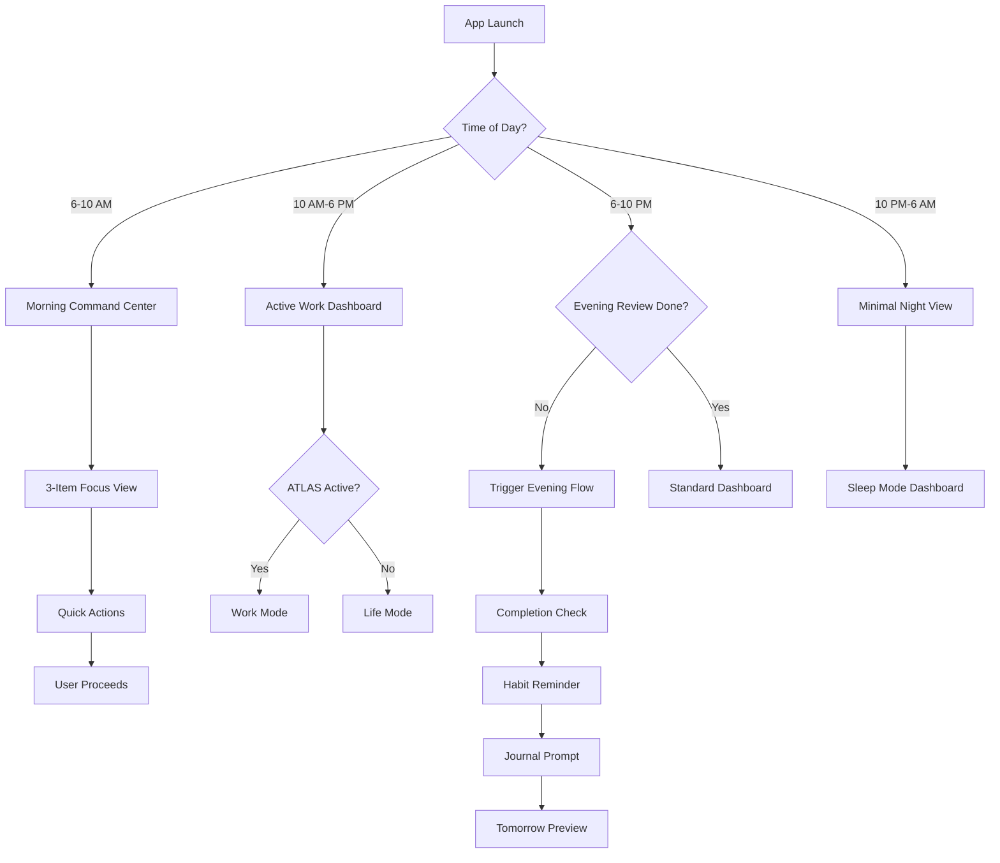

---

## Morning Command Center Flow

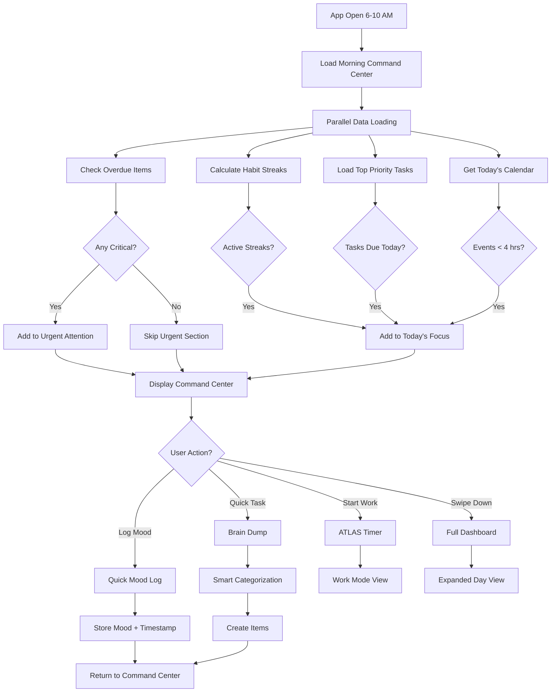

---

## Throughout the Day - Task Surfacing

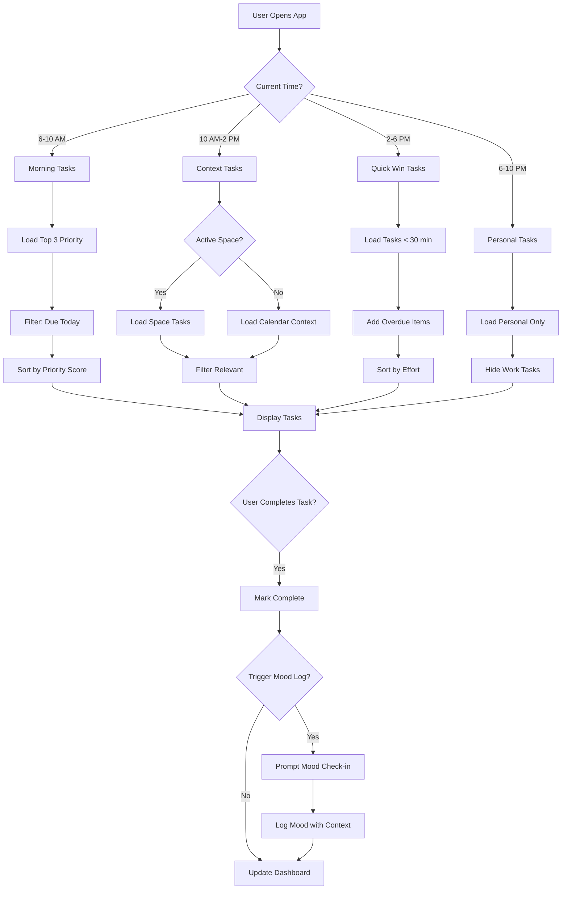

---

## Proactive Suggestion Decision Tree

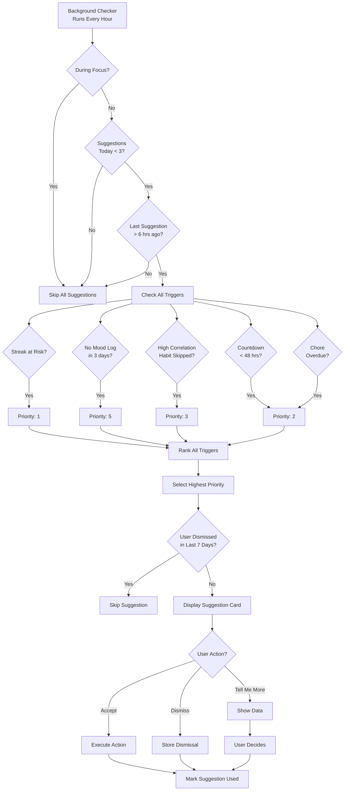

---

## Evening Review Workflow

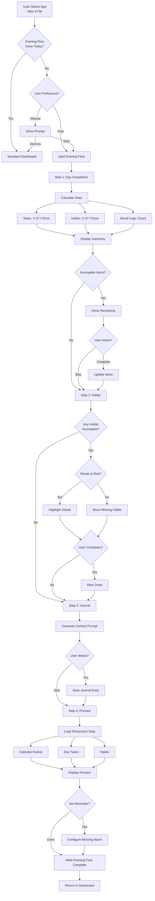

---

## Weekly Planning Flow

```mermaid
graph TD
    A[Start Weekly Planning] --> B[Step 1: Last Week Review]

    B --> C[Query Database]
    C --> D[Task Completion %]
    C --> E[Habit Completion %]
    C --> F[Avg Mood Score]
    C --> G[Best/Worst Days]

    D --> H[Display Stats]
    E --> H
    F --> H
    G --> H

    H --> I{User Continues?}
    I -->|See Details| J[Show Daily Breakdown]
    I -->|Continue| K[Step 2: Calendar Import]

    J --> K

    K --> L[Fetch Calendar Events]
    L --> M[Next 7 Days]
    M --> N[Detect Work Events]
    N --> O[Display Event List]

    O --> P{Auto-Block Focus Time?}
    P -->|Yes| Q[Suggest ATLAS Blocks]
    P -->|No| R[Step 3: Recurring Tasks]

    Q --> S[Calculate Available Gaps]
    S --> T[2+ Hour Blocks Only]
    T --> U[Display Suggestions]
    U --> V{User Accepts?}

    V -->|Yes| W[Create ATLAS Blocks]
    V -->|Customize| X[Manual Adjustment]
    V -->|Skip| R

    W --> R
    X --> R

    R --> Y[Check Recurring Patterns]
    Y --> Z[Weekly Tasks]
    Y --> AA[Chores Due]

    Z --> AB[Auto-Create Tasks]
    AA --> AB

    AB --> AC[Step 4: Habit Commitment]
    AC --> AD[Load Active Habits]
    AD --> AE[Show Last Week Performance]

    AE --> AF{Adjust Frequency?}
    AF -->|Yes| AG[Modify Habits]
    AF -->|No| AH[Step 5: Countdowns]

    AG --> AH

    AH --> AI[Query Countdowns < 7 Days]
    AI --> AJ{Any Critical?}

    AJ -->|Yes| AK[Suggest Task Creation]
    AJ -->|No| AL[Step 6: Task Priority]

    AK --> AM{User Creates?}
    AM -->|Yes| AN[Convert to Tasks]
    AM -->|No| AL

    AN --> AL

    AL --> AO[Load All Tasks]
    AO --> AP[Filter: Due Next Week]
    AP --> AQ[Display for Ranking]

    AQ --> AR{User Selects Top 3?}
    AR -->|Yes| AS[Mark as Priority]
    AR -->|Re-prioritize| AT[Adjust Order]

    AS --> AU[Step 7: Week Preview]
    AT --> AU

    AU --> AV[Generate Day-by-Day View]
    AV --> AW[Mon: X events, Y tasks, Z habits]
    AV --> AX[Tue: ...]
    AV --> AY[... through Sunday]

    AW --> AZ[Display Preview]
    AX --> AZ
    AY --> AZ

    AZ --> BA{Set Reminders?}
    BA -->|Yes| BB[Configure Daily Alarms]
    BA -->|Start Week| BC[Save Plan]

    BB --> BC
    BC --> BD[Return to Dashboard]
```

---

## Quick Capture Flow

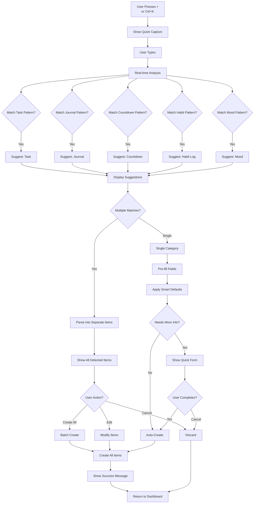

---

## Mood Correlation Analysis Flow

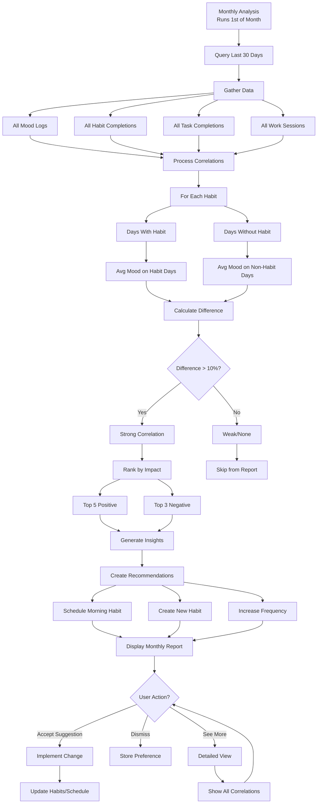

---

## ATLAS Work Integration Flow

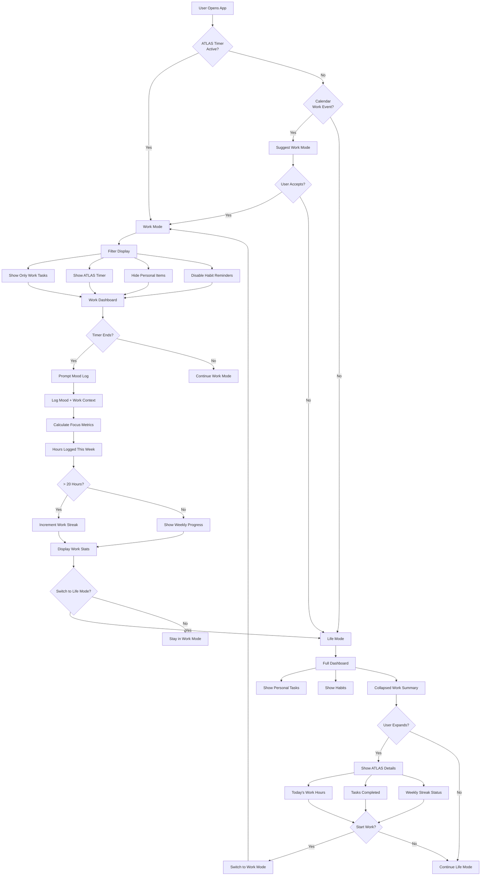

---

## Smart Default Application Flow

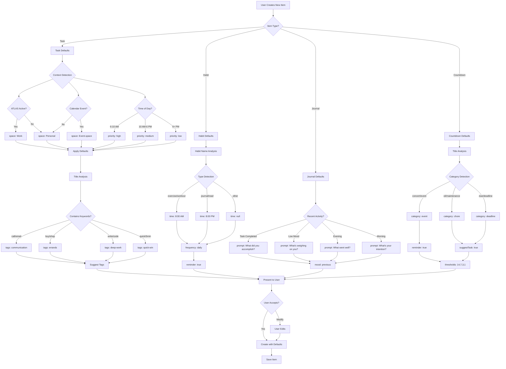

---

## Information Hierarchy Map

```
┌─────────────────────────────────────────────────────────┐
│                    APP DASHBOARD                        │
│                  (Information Layers)                    │
└─────────────────────────────────────────────────────────┘

LAYER 1: CRITICAL (Always Visible - Red Zone)
├─ 🚨 Overdue Items (days overdue count)
├─ 🚨 Countdowns < 48 hours
├─ 🚨 Calendar events < 2 hours
└─ 🚨 Chores past due date
   └─> ACTION REQUIRED NOW

LAYER 2: TODAY (Primary Focus - Yellow Zone)
├─ 📅 Calendar events today (chronological)
├─ ✓ Habits not yet completed (streak visibility)
├─ 📝 Tasks due today (priority sorted)
└─ 💼 Active work timer (if ATLAS running)
   └─> TODAY'S COMMITMENTS

LAYER 3: CONTEXT (Passive Awareness - Green Zone)
├─ 📊 Current mood trend (3-day avg)
├─ 🔥 Active streaks (habits, work)
├─ 🎵 Spotify recently played
├─ 🎫 Upcoming events (7-30 days)
└─ 📈 Weekly completion %
   └─> BACKGROUND INFORMATION

LAYER 4: UPCOMING (Collapsed - Gray Zone)
├─ Tasks due this week (expandable)
├─ Habits weekly summary (expandable)
├─ Future countdowns (expandable)
└─ Long-term goals (expandable)
   └─> FUTURE PLANNING

LAYER 5: QUICK ACTIONS (Always Accessible Footer)
├─ [+ Task] [+ Habit] [+ Journal] [+ Mood]
└─> BRAIN DUMP READY
```

---

## Notification Timing Strategy

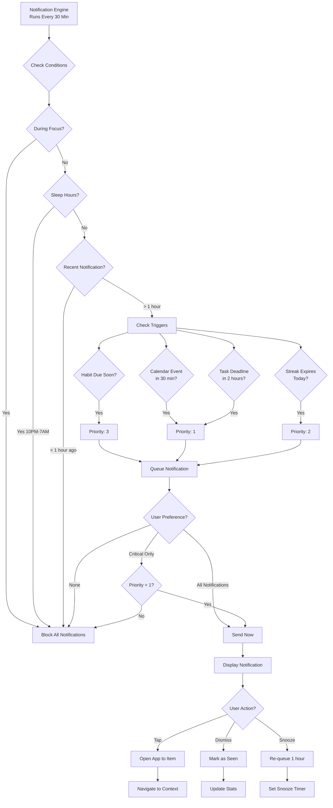

---

## Cross-Feature Data Flow

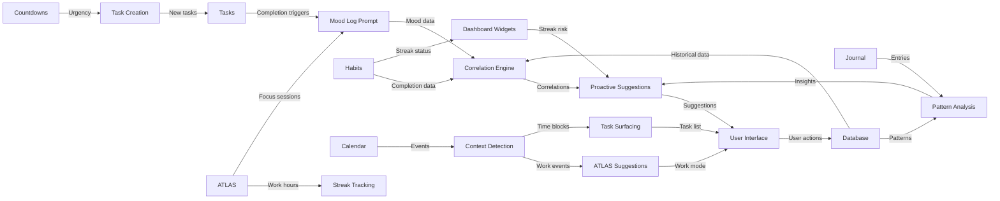

---

## Decision Matrix: When to Show What

| User Context | Show | Hide | Why |
|--------------|------|------|-----|
| **Morning (6-10 AM)** | Top 3 tasks, active streaks, today's calendar | Future items, completed items | Focus energy on priorities |
| **Work Time (ATLAS)** | Work tasks, timer, focus metrics | Personal tasks, habits, unrelated | Minimize distraction |
| **Mid-day (10 AM-2 PM)** | Context tasks, calendar, quick wins | Tomorrow's items, distant countdowns | Maintain momentum |
| **Afternoon (2-6 PM)** | Quick wins, overdue, easy tasks | Complex tasks, new planning | Energy dip = easy victories |
| **Evening (6-10 PM)** | Personal tasks, habits, reflection | Work items, urgent alerts | Work/life separation |
| **Night (10 PM-6 AM)** | Minimal view, emergency only | All notifications, suggestions | Sleep preservation |

---

## State Transitions

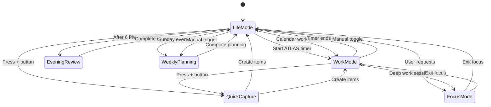

---

## Priority Scoring Algorithm Diagram

```
Task Priority Score Calculation:
═══════════════════════════════════════════

Base Priority:
  High = 3 points
  Medium = 2 points
  Low = 1 point
  × 3 (weight multiplier)
  ─────────────────
  Max: 9 points

Days Until Due:
  Overdue = -10 points
  Due today = -5 points
  Due tomorrow = -3 points
  Due this week = -1 point
  × 2 (weight multiplier)
  ─────────────────
  Max impact: -20 points

Related to Current Space:
  Match = +5 points
  No match = 0 points
  × 1 (weight multiplier)
  ─────────────────
  Max: 5 points

Matches Mood Pattern:
  High mood + task type = +2 points
  × 1 (weight multiplier)
  ─────────────────
  Max: 2 points

Time of Day Optimal:
  Morning task in morning = +4 points
  Deep work during focus time = +4 points
  × 1 (weight multiplier)
  ─────────────────
  Max: 4 points

═══════════════════════════════════════════
TOTAL SCORE RANGE: -20 to +20 points

Example Calculations:
─────────────────────────────────────────
1. "Urgent work task, due today, morning"
   = (3 × 3) + (-5 × 2) + 5 + 0 + 4
   = 9 - 10 + 5 + 0 + 4
   = 8 points → TOP PRIORITY

2. "Low priority, due next week, no context"
   = (1 × 3) + (-1 × 2) + 0 + 0 + 0
   = 3 - 2 + 0 + 0 + 0
   = 1 point → LOW PRIORITY

3. "Overdue, personal task, evening"
   = (2 × 3) + (-10 × 2) + 5 + 0 + 0
   = 6 - 20 + 5 + 0 + 0
   = -9 points → CRITICAL (Red Zone)
```

---

## User Journey Map: First Week Experience

```
DAY 1 (Onboarding)
├─ User installs app
├─ Quick setup: Name, timezone, work hours
├─ Guided tour: "Add your first task"
├─ Prompt: "What habits do you want to track?"
└─ Outcome: 2 tasks, 2 habits created

DAY 2 (First Morning)
├─ Morning Command Center appears
├─ Shows: 2 tasks, 2 habits (0% complete)
├─ User completes 1 task → Mood prompt
├─ First mood log recorded
└─ Outcome: User sees streak start

DAY 3 (Building Routine)
├─ Morning shows: 1-day habit streak
├─ User completes both habits
├─ Evening review prompt appears
├─ First journal entry written
└─ Outcome: Streak reinforcement

DAY 4 (First Suggestion)
├─ App suggests: "Exercise correlates with better mood"
├─ User schedules exercise
├─ Completes exercise → Mood log (high)
└─ Outcome: Sees first correlation

DAY 5 (Work Integration)
├─ User starts ATLAS timer for work
├─ Work mode hides personal tasks
├─ Focus session: 2 hours
├─ Mood log after work: Productive feeling
└─ Outcome: Work/life separation clear

DAY 6 (First Weekend)
├─ No work items shown
├─ Personal tasks only
├─ Habit streaks at 5 days
├─ User adds countdown for concert
└─ Outcome: Life mode autonomy

DAY 7 (Weekly Review)
├─ Sunday evening review prompt
├─ Stats: 80% task completion, 6-day streaks
├─ First weekly insights shown
├─ Next week planning started
└─ Outcome: User hooked on system

WEEK 2+
├─ Proactive suggestions increase
├─ Correlations become visible
├─ Streaks become motivators
├─ System adapts to user patterns
└─ Outcome: Habit formation successful
```

---

**These flowcharts and diagrams provide visual clarity for implementing the ADHD-optimized workflow design, ensuring every interaction is intentional and user-centric.**
